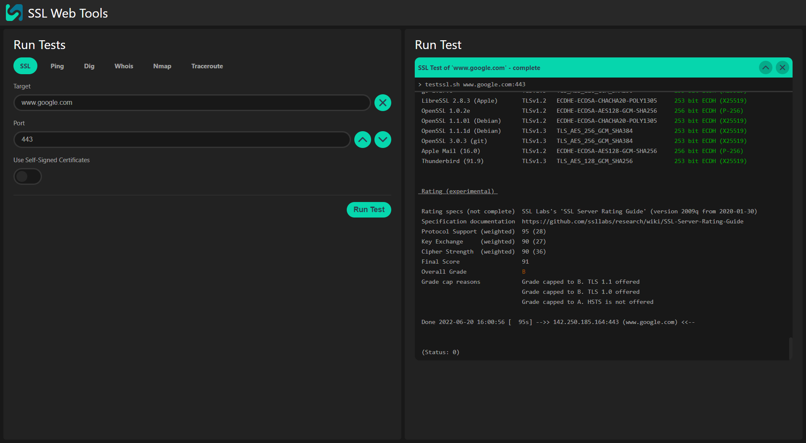
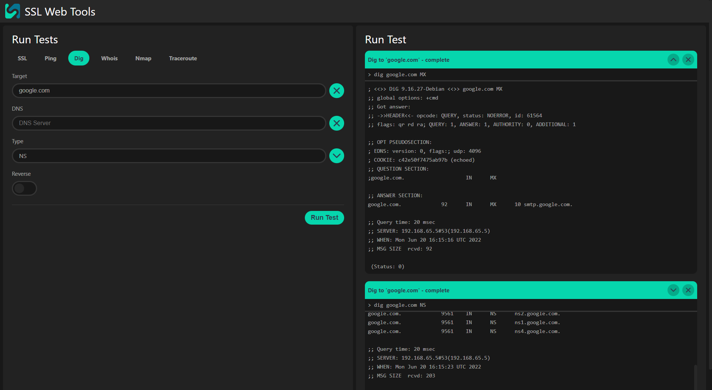
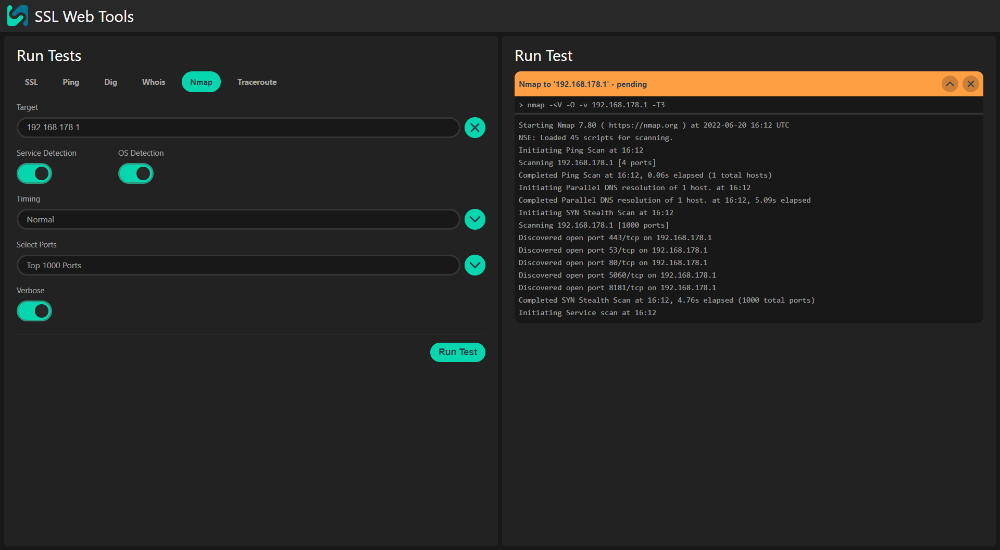

# SSL Web Tools

<div align="center" width="100%">
  
</div>

\
SSL Web Tools is a collection of tools to help you configure and set up new HTTPS websites.

## 📸 Screenshot

<div align="center" width="100%">
  
</div>
More screenshots can be found in at the bottom of this page.

## 📐 Current Features

- Fancy, and Fast Web Interface
- SSL Auditing Tool [testssl.sh](https://github.com/drwetter/testssl.sh) by [drwetter](https://github.com/drwetter)
- Ping
- DNS Lookup with [dig](https://manpages.ubuntu.com/manpages/jammy/en/man1/dig.1.html)
- Nmap Scanner [nmap](https://nmap.org/)
- Traceroute

## 🔨 Installation

### 🐳 Docker

```bash
docker run -d -p 9000:9000 --name ssl-web-tools hithere157/ssl-web-tools:1.1.2
```

After the container is started, you can access it via the following URL: http://localhost:9000

### 🐙 Docker Compose

An Example of a Docker Compose File:

```yaml
version: "3.9"
services:
  web:
    image: hithere157/ssl-web-tools:1.1.2
    ports:
      - "9000:9000"
    volumes:
      - ./config:/app/config
      - ./caCerts:/caCerts
```

To start the container, run:

```bash
docker-compose up -d
```

Again, you can access it via the following URL: http://localhost:9000

## ⭐ Configuration for Reverse Proxy

If you want to use SSL Web Tools behind a reverse proxy, you need to configure the reverse proxy to use following configurations: https://socket.io/docs/v4/reverse-proxy/

## 💡 Advanced Configuration

Additional Root Certificates for SSL/TLS Tests can be added to the `/caCerts` directory via a [docker volume](https://docs.docker.com/storage/volumes/). All Certificates must be in PEM format and must be named `<name>.pem`.

After the container is started, a default configuration is created in the `/app/config` directory. You can edit this file to change the default values of all the settings for individual tools. \
You will need a [docker volume](https://docs.docker.com/storage/volumes/) to save the configuration file between container restarts.

## 🏆 Contributing

SSL Web Tools is designed with the intention to be easily expandable.
If you have any suggestions for new tools or missing settings, please open an issue or pull request on [GitHub](https://github.com/HiThere157/ssl-web-tools)

## 📸 Even More Screenshots

<div align="center" width="100%">
  
  
  
</div>
